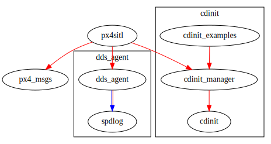

Overview
========

<table>
  <tr>
    <td align="center">
        CI status
    </td>
    <td align="center">
        Debian package
    </td>
  </tr>
  <tr>
    <td align="center">
        <a href="https://github.com/asherikov/px4ws/actions/workflows/main.yaml">
        
        </a>
    </td>
    <td align="center">
        <br />
        <a href="https://cloudsmith.io/~asherikov-aV7/repos/all/packages/detail/deb/px4ws--reldebug--all/latest/a=amd64;d=ubuntu%252Fnoble;t=binary/">
        
        </a>
    </td>
  </tr>
</table>


Multi-drone PX4 SITL setup using Gazebo and ROS2. Generally follows
<https://docs.px4.io/main/en/sim_gazebo_gz/>, but uses custom bringup scripts
which serve as a showcase of <https://github.com/asherikov/cdinit>.

Workspace documentation is at <http://www.sherikov.net/px4ws/>.


Packages
--------
```
PX4-Autopilot/PX4-Autopilot                         main             https://github.com/asherikov/PX4-Autopilot.git
cdinit                                              master           https://github.com/asherikov/cdinit.git
dds_agent/Micro-XRCE-DDS-Agent/Micro-XRCE-DDS-Agent v2.4.3           https://github.com/eProsima/Micro-XRCE-DDS-Agent.git
dds_agent/spdlog                                    v1.9.2           https://github.com/gabime/spdlog.git
px4_msgs                                            as_disable_tests https://github.com/asherikov/px4_msgs.git
```
`PX4-Autopilot` and `Micro-XRCE-DDS-Agent` are build using proxy packages in
order to apply a few `cmake` tweaks


Usage
=====

Building
--------

- Compilation is performed with <https://github.com/asherikov/ccws>, although
  basic `colcon` build should work too.

- Dependencies can be installed with `rosdep` except a few PX4 python
  dependencies that are installed with cmake during build step.

Running
-------

- Build `px4sitl` master package.
- Run `px4sitl.sh -w walls -d 4001 "0,1.0,0,0,0,0" -d 4004 "0,-5.0,0,0,0,0"`
  where `-w` specifies world ('default' if not set), `-d` specifies a drone
  model id and its location (x,y,z,r,p,y). Numerical ids can be found in a
  table at <https://docs.px4.io/main/en/sim_gazebo_gz/>.
- `px4sitl.sh` also supports headless mode, which is enabled by passing `-H`
  flag.
- Terminate by closing Gazebo gui, or with `cdinit.sh shutdown`.

cdinit services
---------------

All components are started using `dinit` service files, see
<https://github.com/davmac314/dinit>, <https://github.com/asherikov/cdinit>
provides a cmake wrapper for `dinit` and helper scripts. Shell scripts are
primarily used to setup environment and working directories.

### Example

- Start `px4sitl.sh -w walls -d 4001 "0,1.0,0,0,0,0" -d 4004 "0,-5.0,0,0,0,0"`
- List services `cdinit.sh list | sort` to get something like
```
# dummy "boot" service
[[+]     ] cdinit_main
# Gazebo gui
[[+]     ] px4sitl_gz_gui (pid: XXX)
# PX4 instances, number after @ symbol is a corresponding system id
[[+]     ] px4sitl_px4@0 (pid: XXX)
[[+]     ] px4sitl_px4@1 (pid: XXX)
# logging services
[{+}     ] cdinit_log@px4sitl_dds_agent (pid: XXX)
[{+}     ] cdinit_log@px4sitl_gz_clock (pid: XXX)
[{+}     ] cdinit_log@px4sitl_gz_gui (pid: XXX)
[{+}     ] cdinit_log@px4sitl_gz_headless (pid: XXX)
[{+}     ] cdinit_log@px4sitl_gz_wait (pid: XXX)
[{+}     ] cdinit_log@px4sitl_px4@0 (pid: XXX)
[{+}     ] cdinit_log@px4sitl_px4@1 (pid: XXX)
# Micro-XRCE-DDS-Agent bridging PX4 and ros2
[{+}     ] px4sitl_dds_agent (pid: XXX)
# Gazebo -> ROS2 simulation clock bridge
[{+}     ] px4sitl_gz_clock (pid: XXX)
# Gazebo simulation core
[{+}     ] px4sitl_gz_headless (pid: XXX)
# Helper service which waits for Gazebo to start
[{+}     ] px4sitl_gz_wait
# Dummy "master" service
[{+}     ] px4sitl_ros
```
- Location of the log files depends on environment variables, e.g.,
  `ROS_LOG_DIR`, and by default it is set to `${HOME}/.sharf/cdinit`.
- Terminate using `cdinit.sh shutdown`. Since all processes are required,
  termination can also be performed by stopping a particular service, e.g.,
  `cdinit.sh stop --force px4sitl_gz_clock`.


Troubleshooting
===============

- `protobuf` errors like the following could be caused by multiple Gazebo
  versions installed in parallel: `[libprotobuf ERROR
  google/protobuf/descriptor_database.cc:121] File already exists in database:
  gz/msgs/pointcloud.proto`

Packages
========

Dependency graph
----------------

[](pkg_dependency_graph.svg)

Doxygen documentation
---------------------

| **Package** | Dependencies | Dependents |
| ----------- | :----------: | :--------: |
| [cdinit](./cdinit/index.html) | [graph](./cdinit/pkg_dependency_graph.svg) | [graph](./cdinit/pkg_reverse_dependency_graph.svg) |
| [cdinit_examples](./cdinit_examples/index.html) | [graph](./cdinit_examples/pkg_dependency_graph.svg) | [graph](./cdinit_examples/pkg_reverse_dependency_graph.svg) |
| [cdinit_manager](./cdinit_manager/index.html) | [graph](./cdinit_manager/pkg_dependency_graph.svg) | [graph](./cdinit_manager/pkg_reverse_dependency_graph.svg) |
| [dds_agent](./dds_agent/index.html) | [graph](./dds_agent/pkg_dependency_graph.svg) | [graph](./dds_agent/pkg_reverse_dependency_graph.svg) |
| [px4_msgs](./px4_msgs/index.html) | [graph](./px4_msgs/pkg_dependency_graph.svg) | [graph](./px4_msgs/pkg_reverse_dependency_graph.svg) |
| [px4sitl](./px4sitl/index.html) | [graph](./px4sitl/pkg_dependency_graph.svg) | [graph](./px4sitl/pkg_reverse_dependency_graph.svg) |
| [spdlog](./spdlog/index.html) | [graph](./spdlog/pkg_dependency_graph.svg) | [graph](./spdlog/pkg_reverse_dependency_graph.svg) |

Total number of packages: 
7

Workspace status
-----
:::{.wide}
```
tags/0.1.0-0-g50d8239
WSH: >>> status: git sources ---
Flags: H - version hash mismatch, M - uncommited changes
name                                                version          actual version                    HM repository
----                                                -------          --------------                    -- ----------
PX4-Autopilot/PX4-Autopilot                         main             heads/main-0-g2e586c4                https://github.com/asherikov/PX4-Autopilot.git
cdinit                                              master           heads/master-0-g574b897              https://github.com/asherikov/cdinit.git
dds_agent/Micro-XRCE-DDS-Agent/Micro-XRCE-DDS-Agent v2.4.3           tags/v2.4.3-0-g7362281               https://github.com/eProsima/Micro-XRCE-DDS-Agent.git
dds_agent/spdlog                                    v1.9.2           tags/v1.9.2-0-geb32206               https://github.com/gabime/spdlog.git
px4_msgs                                            as_disable_tests heads/as_disable_tests-0-g1398c8b    https://github.com/asherikov/px4_msgs.git

WSH:  <<< status: git sources ---
```
:::


Useful links
============

- [ROS online status](https://status.openrobotics.org/)
- [ROSDEP packages](https://github.com/ros/rosdistro/blob/master/rosdep/base.yaml)

ROS1
----
- [C++ API](http://docs.ros.org/en/noetic/api/roscpp/html/)
- [catkin API](https://docs.ros.org/en/noetic/api/catkin/html/dev_guide/generated_cmake_api.html)

ROS2
----
- [C++ API](https://docs.ros2.org/latest/api/rclcpp/namespacerclcpp.html)
- [ament](https://docs.ros.org/en/foxy/How-To-Guides/Ament-CMake-Documentation.html)
